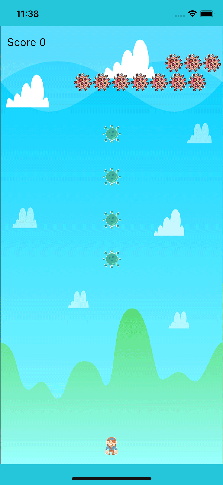
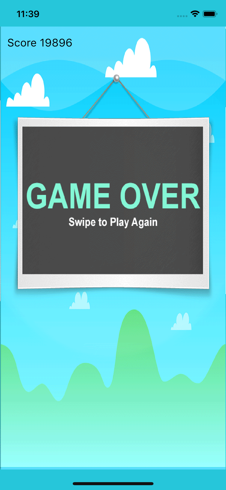

# COVID-19 Fighters (Coronavirus 8bit Fighters)
Remember the days of 8bit computing where we only had limited resources to play with, when games 
were elementary and the graphics terrible❗️ This a take on an 8bit game, with simple gameplay and 
terribly old fashioned graphics 😅 

This game uses a simple Flutter code serves as basic "game engine", the engine (core) of the game 
has been developed based on the published repository on https://github.com/amugofjava/dash_run

#### Running the game
- Clone the repo with: git clone https://github.com/hanisimo/covid_fighters.git
- Change to the "covid_fighters" directory and then execute: Flutter run

#### Playing the game
Swipe left and right to move your team member. Tap to throw a antivirus. If an on of the COVID-19 
virus manages to reach the ground or peck the Fighter, the game ends.

#### Screenshots

#### Third party libraries
The developer of the original repository (at https://github.com/amugofjava/dash_run) has wanted to 
see what he could build within the 5Kb limit and just the Flutter SDK. As such, this app does not 
use any plugins or additional packages.

#### Original Repository 
This project has been forked from "dash_run" project at "https://github.com/amugofjava/dash_run"

#### License
The original source is made available under the MIT license; and this fork maintains the same MIT 
license. See the LICENSE file for details.

### Credits & Acknowledgements
Ben Hills: the developer of the original version of this project (https://github.com/amugofjava/dash_run). 

Flaticon (www.flaticon.com): FREE LICENSE (WITH ATTRIBUTION), kindly check Flaticon LICENSE for the 
use of its graphics.

Kenney (www.kenney.nl):
- Toon Characters Pack 1, Created/distributed by Kenney (www.kenney.nl)
- License (Creative Commons Zero, CC0): http://creativecommons.org/publicdomain/zero/1.0/
- This content is free to use in personal, educational and commercial projects.

FREE PLANE SPRITE (www.gameart2d.com)
- Free Assets License (https://www.gameart2d.com/license.html), For the game assets in Freebies 
  section, it's under Creative Common Zero (CC0) a.k.a Public Domain license.

### Disclaimer
THE SOFTWARE IS PROVIDED "AS IS", WITHOUT WARRANTY OF ANY KIND, EXPRESS OR IMPLIED, INCLUDING BUT 
NOT LIMITED TO THE WARRANTIES OF MERCHANTABILITY, FITNESS FOR A PARTICULAR PURPOSE AND 
NONINFRINGEMENT. IN NO EVENT SHALL THE AUTHORS OR COPYRIGHT HOLDERS BE LIABLE FOR ANY CLAIM, 
DAMAGES OR OTHER LIABILITY, WHETHER IN AN ACTION OF CONTRACT, TORT OR OTHERWISE, ARISING FROM, OUT 
OF OR IN CONNECTION WITH THE SOFTWARE OR THE USE OR OTHER DEALINGS IN THE SOFTWARE.
